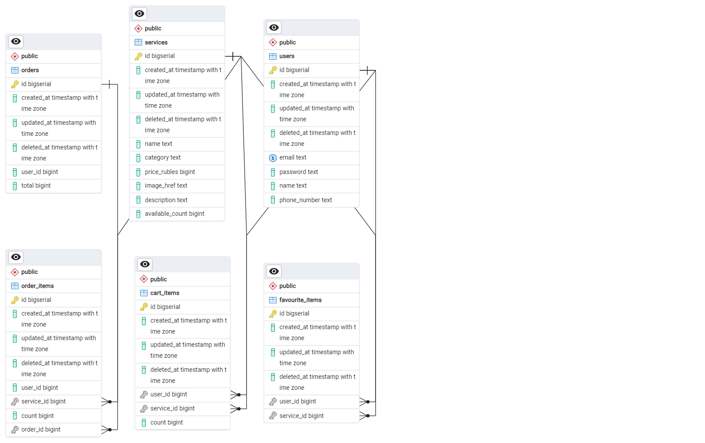

# Практика 13 Столяров ЭФБО-01-22 22T0318

## Задание.
Реализовать оплату корзины. Добавить отображение заказов в профиле.

## Ход выполнения

### Шаг 1. Обновление API

Добавлены новые таблицы: orders для хранения заказов и order_items для хранения позиций (товар, количество) этих заказов.

Структура БД на текущий момент:

addOrder() принимает ID пользователя и с помощью транзакции перемещает товары из корзины в таблицу order_items и создаёт связанную запись в таблице orders.

<pre>
func addOrder(writer http.ResponseWriter, request *http.Request) {
	user_id := request.URL.Query().Get("user_id")
	user_id_parsed, _ := strconv.Atoi(user_id)
	cartItems := []CartItem{}
	var order_id uint
	db.Transaction(func(tx *gorm.DB) error {
		tx.Where("user_id=?", user_id_parsed).Preload("Service").Find(&cartItems)
		tx.Where("user_id=?", user_id_parsed).Unscoped().Delete(&CartItem{})
		var total uint = 0
		// calc total
		for _, cartItem := range cartItems {
			total += cartItem.Count * cartItem.Service.PriceRubles
		}
		order := Order{Total: total, UserID: uint(user_id_parsed)}
		tx.Create(&order)
		order_id = order.ID
		for _, cartItem := range cartItems {
			orderItem := OrderItem{CartItem: cartItem, OrderID: order.ID}
			tx.Create(&orderItem)
		}
		return nil
	})
	order := Order{}
	db.Find(&order, "id=?", order_id)
	writer.Header().Set("Content-Type", "application/json; charset=utf-8")
	json.NewEncoder(writer).Encode(order)
}
</pre>

Также напишем функцию getOrders(), которая возвращает список заказов в формате JSON.

<pre> 
func getOrders(writer http.ResponseWriter, request *http.Request) {
	user_id := request.URL.Query().Get("user_id")
	user_id_parsed, _ := strconv.Atoi(user_id)
	orders := []Order{}
	db.Where("user_id=?", user_id_parsed).Preload("OrderItems.Service").Find(&orders)
	writer.Header().Set("Content-Type", "application/json; charset=utf-8")
	json.NewEncoder(writer).Encode(orders)
}
</pre>

Весь API описан в файле <a href="./backend/backend.go">backend.go</a> и протестирован с помощью <a href="https://elements.getpostman.com/redirect?entityId=24015280-8a099f19-cf00-4125-9654-e3b574800df0&entityType=collection">Postman</a>

### Шаг 2. Создание страницы с заказами

В профиле теперь есть кнопка "Мои заказы", по нажатию на которую открывается страница с заказами, которые подгружаются из API.

После оплаты содержимое корзины очищается, и соответствующая запись появляется в "Мои Заказы"

### Результат (.GIF)

